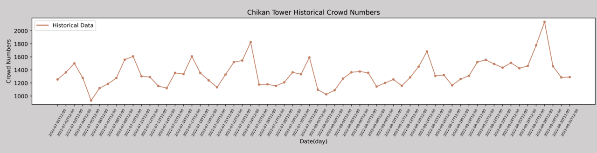
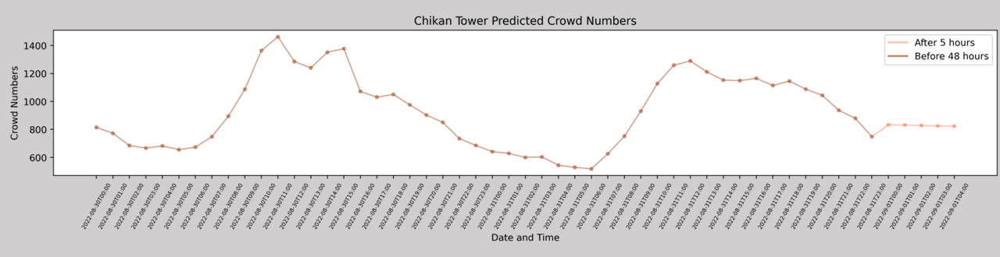

# ***Crowd Forecasting_Take "Chikan Tower (赤崁園區)" as an example***
## Lai Shih - Yu
---
## **Crowd Forecasting**

 
 
  * Demo

▌Introduction

The prediction of the crowd pattern involves a huge amount of data and research demonstrations. Therefore, the primary goal of this case is to define an effective and feasible estimation method, which can be used as a research reference in the case of sufficient data.
In addition, in order to avoid the traffic and safety problems caused by the explosion of crowds, this case uses the historical data of Far EasTone Telecom, the historical ticket sales data of tourist attractions, and the factors related to crowds on open platforms, in order to establish an effective crowd estimation model, and then assist the municipality in pre-deploying controls before a crisis occurs, such as: order maintenance, traffic control, and passenger limit.

 

The 5 tourist attractions of this crowd forecasting project include Chikan Tower (赤崁園區), Guohua Haian Shopping Area（國華海安商圈）, Anping Old Street（安平老街）, Yuguang Island（漁光島）, Confucius Temple（孔廟園區）. To simplify the project code, only the Chikan Tower (赤崁園區) crowd forecasting is taken as a demonstration.

 

The `mobile data` obtained from `Far EasTone Telecom` for this project is: the hourly number of people in Chikan Tower in July and August 2022. In order to establish an effective and accurate estimation model and verify the accuracy of the forecast, this case uses mobile data. In addition, other crowd factor data that can symbolize or represent the number of crowds are also used, for example: `temperature`, `rainfall`, and `daily ticket` are used as reference factors, and `holiday data` of recurring events (routine schedules) are considered, such as : weekends, national holidays, winter and summer vacations, etc. Finally, use the time-sharing `usage data of parking spaces`, because in addition to being an influencing factor, it may also have the nature of a crowd factor or a response factor.

 

▌Datasets

1. *`2022_Jun-Sep_降雨量(mm)_分景點_小雨1,大雨2,強雨3.csv`*: Rainfall Data.

2. *`2022_Jun-Sep_溫度(C)_分景點.csv`* : Temperature Data.

3. *`2022holiday(hour).csv`* : Inventory data of various holiday type(transfer into hourly format).

4. *`赤崁樓_票券轉換7_8.csv`*: Attraction ticket numbers data.

5. *`停車逐時資料_赤崁園區.csv`* : Data of the number of hourly parking spaces around the location.

6. *`遊客分時信令.xlsx`* : Mobile data(crowd number).

7. *`Chikan_Tower_Best_Model`* : The *`model parameters`* for models from the variables.

▌Results

     
 
  * Isochrones of tourist attractions
  

   

  * Chikan Tower Historical Crowd Numbers
  

     
  
  * Chikan Tower Predicted Crowd Numbers
  
   

▌Steps
 

It is strongly recommended to run `.ipynb` file on Google Colab instead of `.py` files, in case the graphics card on the local side of the computer is overwhelmed.

1. *`Data Acquisition`*: Take "Chikan Tower (赤崁園區)" as an example below, try to design a forecasting model, and obtain the number of hourly crowds (num) from the folder. For this part, only the location name (loc) needs to be changed.

   

    import pandas

2. *`Build a Forecasting Model and Visualization`* : 
   
    Import modules.
   
 

    import numpy as np

    import math

    import matplotlib.pyplot as plt

    from keras import datasets

    from keras.models import Sequential

    from keras.layers import Dense, SimpleRNN, LSTM, Dropout,GRU, Attention

    from sklearn.model_selection import train_test_split, cross_val_score

    from sklearn.preprocessing import MinMaxScaler

    from sklearn.metrics import accuracy_score

3. *`Data Processing and Split into Train Data and Test Data.`* : Through the data of 48 hours before this hour, predict the 5 hours after this hour, "input_dim = 6" means that a total of six variables (that is, all variables) are used. 
If you only want to predict signal data(crowd number) and with another variable arbitrarily,please set input_dim = 2.

4. *`Model Architecture`* : 
   
    Import deep learning modules.
   
 

    import tensorflow as tf
    import keras
    from keras.layers import Input, Dense
    from keras.layers import Layer
    import keras.backend as K
    from keras import Model,callbacks
    from keras import optimizers
    import torch

5. *`Experiment to Compare Different Models and Their Results.`* : After comparing the three time series models of LSTM, GRU, and GRU-Attention, because the difference in Loss is not large, the GRU model with the least number of parameters is used to reduce the model inference time..

6. *`Load the Best Model, and Visualization`* : You can predict the results by loading the models from the folder called `Chikan_Tower_Best_Model`, if you want to load the other models with mobile data and one another variable (such as Rainfall Data), please go to this [Link](https://drive.google.com/drive/folders/16aHZ4vlz4ARZSpSh6-P8Dq8lnG6JmW8b?usp=sharing) to download. Taking All Variables Data as Example, you cn visualize the `Predictive Result` and the `Historical Data`.
